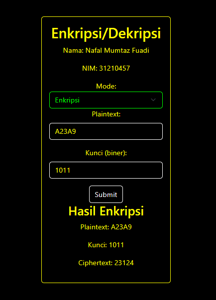

# Enkripsi/Dekripsi Program



Program ini adalah implementasi sederhana dari algoritma enkripsi XOR dalam bahasa PHP. Program ini memungkinkan pengguna untuk melakukan enkripsi dan dekripsi teks menggunakan kunci biner.
## Deskripsi
Program ini dibuat sebagai bagian dari tugas mata kuliah keamanan komputer untuk memahami konsep dasar enkripsi XOR. Meskipun sederhana, program ini dapat memberikan gambaran tentang bagaimana algoritma enkripsi dapat diimplementasikan menggunakan PHP.

## Kodingan yah
```php
<?php
// Metadata Program
// Nama: Nafal Mumtaz Fuadi
// NIM: 31210457

// Nama dan NIM
$nama = "Nafal Mumtaz Fuadi";
$nim = "31210457";

function hexToBin($hex)
{
    $bin = '';
    $length = strlen($hex);
    for ($i = 0; $i < $length; $i++) {
        $bin .= str_pad(decbin(hexdec($hex[$i])), 4, '0', STR_PAD_LEFT);
    }
    return $bin;
}

function binToHex($bin)
{
    $hex = '';
    $length = strlen($bin);
    for ($i = 0; $i < $length; $i += 4) {
        $hex .= dechex(bindec(substr($bin, $i, 4)));
    }
    return $hex;
}

function encrypt($plaintextHex, $keyBinary)
{
    $plaintextBinary = hexToBin($plaintextHex);
    $blockSize = 4;
    $blocks = str_split($plaintextBinary, $blockSize);
    $ciphertext = '';
    $xorResults = [];

    // Menampilkan hasil biner plaintext per blok
    // echo "Plaintext (Biner per Blok 4 Bit): ";
    // foreach ($blocks as $block) {
    //     echo $block . ' ';
    // }
    // echo "\n";

    // Menampilkan key
    // echo "Key (Biner): $keyBinary\n";

    foreach ($blocks as $block) {
        $blockXOR = sprintf('%04b', bindec($block) ^ bindec($keyBinary));
        $blockShifted = substr($blockXOR, 1) . substr($blockXOR, 0, 1);
        $xorResults[] = $blockShifted;
        $blockHex = binToHex($blockShifted);
        $ciphertext .= $blockHex;
    }

    // Menampilkan hasil XOR (belum diubah ke dalam hexadesimal)
    // echo "Hasil XOR (Biner per Blok 4 Bit): ";
    // foreach ($xorResults as $result) {
    //     echo $result . ' ';
    // }
    // echo "\n";

    return $ciphertext;
}

function decrypt($ciphertextHex, $keyBinary)
{
    $ciphertextBinary = hexToBin($ciphertextHex);
    $blockSize = 4;
    $blocks = str_split($ciphertextBinary, $blockSize);
    $plaintext = '';
    $xorResults = [];

    // Menampilkan hasil biner ciphertext per blok
    // echo "Ciphertext (Biner per Blok 4 Bit): ";
    // foreach ($blocks as $block) {
    //     echo $block . ' ';
    // }
    // echo "\n";

    // Menampilkan key
    echo "Key (Biner): $keyBinary\n";

    foreach ($blocks as $block) {
        $blockShifted = substr($block, -1) . substr($block, 0, -1);
        $blockXOR = sprintf('%04b', bindec($blockShifted) ^ bindec($keyBinary));
        $xorResults[] = $blockXOR;
        $blockHex = binToHex($blockXOR);
        $plaintext .= $blockHex;
    }

    // Menampilkan hasil XOR (belum diubah ke dalam hexadesimal)
    // echo "Hasil XOR (Biner per Blok 4 Bit): ";
    // foreach ($xorResults as $result) {
    //     echo $result . ' ';
    // }
    // echo "\n";

    return $plaintext;
}

// Input dari formulir jika sudah disubmit
$plaintextHex = isset($_POST["plaintext"]) ? $_POST["plaintext"] : "";
$keyBinary = isset($_POST["key"]) ? $_POST["key"] : "";
$ciphertextHex = isset($_POST["ciphertext"]) ? $_POST["ciphertext"] : "";
$mode = isset($_POST["mode"]) ? $_POST["mode"] : "encrypt";

$result = "";

if ($_SERVER["REQUEST_METHOD"] == "POST") {
    if ($mode == "encrypt") {
        $result = encrypt($plaintextHex, $keyBinary);
    } elseif ($mode == "decrypt") {
        $result = decrypt($ciphertextHex, $keyBinary);
    }
}
?>

<!DOCTYPE html>
<html lang="en">
<head>
    <meta charset="UTF-8">
    <meta name="viewport" content="width=device-width, initial-scale=1.0">
    <title>Enkripsi/Dekripsi</title>
    <!-- <link rel="stylesheet" href="style.css"> -->
    <style>
        body {
            display: flex;
            justify-content: center;
            align-items: center;
            height: 100vh;
        }
    </style>
    <!-- bootstrap css -->
    <link href="https://cdn.jsdelivr.net/npm/bootstrap@5.3.2/dist/css/bootstrap.min.css" rel="stylesheet"
     integrity="sha384-T3c6CoIi6uLrA9TneNEoa7RxnatzjcDSCmG1MXxSR1GAsXEV/Dwwykc2MPK8M2HN" crossorigin="anonymous">
</head>
<body>
<div class="card text-bg-primary w-75 mb-3 text-center" style="max-width: 18rem;">
  <div class="card-body">
    <form method="post" action="<?php echo $_SERVER['PHP_SELF']; ?>">
    <p class="h2">Enkripsi/Dekripsi</p>

     <!-- Menambahkan dua input untuk nama dan NIM -->
<div class="mb-3">
    <p>Nama: <?php echo $nama; ?></p>
</div>

<div class="mb-3">
    <p>NIM: <?php echo $nim; ?></p>
</div>


        <label for="mode">Mode:</label>
        <select class="form-select" aria-label="Disabled select" name="mode" id="mode" disabled>
            <option value="encrypt" <?php echo ($mode == "encrypt") ? "selected" : ""; ?>>Enkripsi</option>
            <option value="decrypt" <?php echo ($mode == "decrypt") ? "selected" : ""; ?>>Dekripsi</option>
        </select>
        <div class="mb-3">
        <?php if ($mode == "encrypt"): ?>
            <label for="plaintext" class="form-label">Plaintext:</label>
            <input type="text" class="form-control" name="plaintext" id="plaintext" value="<?php echo $plaintextHex; ?>" required>
        </div>
    <?php elseif ($mode == "decrypt"): ?>
        <label for="decrypt" class="form-label">Ciphertext:</label>
        <input type="text" class="form-control" name="ciphertext" id="ciphertext" value="<?php echo $ciphertextHex; ?>" required>
    </div>
    <?php endif; ?>
    
    <div class="mb-3">
        <label for="key" class="form-label">Kunci (biner):</label>
        <input type="text" class="form-control" name="key" id="key" value="<?php echo $keyBinary; ?>" required>
    </div>
    
    <div class="col-auto">
        <p></p>
        <button type="submit" class="btn btn-success" value="<?php echo ($mode == "encrypt") ? "Enkripsi" : "Dekripsi"; ?>">Submit</button>
    </div>
</form>
<!-- ... (remaining code) ... -->

<!-- Menampilkan hasil enkripsi atau dekripsi jika formulir sudah disubmit -->
<?php if ($_SERVER["REQUEST_METHOD"] == "POST"): ?>
    <h3>Hasil <?php echo ($mode == "encrypt") ? "Enkripsi" : "Dekripsi"; ?></h3>
    <p><?php echo ($mode == "encrypt") ? "Plaintext" : "Ciphertext"; ?>: <?php echo ($mode == "encrypt") ? $plaintextHex : $ciphertextHex; ?></p>
    <p>Kunci: <?php echo $keyBinary; ?></p>
    <p><?php echo ($mode == "encrypt") ? "Ciphertext" : "Plaintext"; ?>: <?php echo $result; ?></p>
<?php endif; ?>

<!-- <div class="card text-center">
  <div class="card-body"> -->
<!-- bootstrap js -->
<script src="https://cdn.jsdelivr.net/npm/bootstrap@5.3.2/dist/js/bootstrap.bundle.min.js" 
integrity="sha384-C6RzsynM9kWDrMNeT87bh95OGNyZPhcTNXj1NW7RuBCsyN/o0jlpcV8Qyq46cDfL" crossorigin="anonymous"></script>
</html>
```

## Gambar versi bahasa Pyhton 
[versi Image python](ECB PROGRAM.PNG)
#kodingan yah
```python
def hex_to_bin(hex_val):
    return bin(int(hex_val, 16))[2:].zfill(4)

def bin_to_hex(bin_val):
    return hex(int(bin_val, 2))[2:]

def shift_left(bin_val):
    return bin_val[1:] + bin_val[0]

def xor(bin_val, key):
    return ''.join('1' if b != k else '0' for b, k in zip(bin_val, key))

def ecb_encrypt(plaintext, key):
    plaintext = [hex_to_bin(c) for c in plaintext]
    key = key.zfill(4)
    ciphertext = []
    
    for block in plaintext:
        xor_result = xor(block, key)
        shifted = shift_left(xor_result)
        ciphertext.append(bin_to_hex(shifted))
    
    return ciphertext

# Ganti dengan nama dan nim Anda
print("Nama: NAFAL MUMTAZ FUADI")
print("NIM: 312110457")

plaintext = input("Masukkan Plainteks: ")
key = input("Masukkan kunci: ")

ciphertext = ecb_encrypt(plaintext, key)
print("Hasil enkripsi ecb:", ciphertext)
```

## Formulir Input

- **Mode:** Pilih mode enkripsi atau dekripsi.
- **Plaintext:** Masukkan teks yang akan dienkripsi (hanya untuk mode enkripsi).
- **Ciphertext:** Masukkan teks yang akan didekripsi (hanya untuk mode dekripsi).
- **Kunci (biner):** Masukkan kunci biner untuk proses enkripsi atau dekripsi.

## Hasil Output

Setelah menekan tombol "Submit", hasil enkripsi atau dekripsi beserta informasi nama dan NIM akan ditampilkan di bawah formulir.
## Metadata Program

- Nama: Nafal Mumtaz Fuadi
- NIM:  312110457
- Bahasa Pemrograman: PHP & Python
- Framework: Tidak ada
- Versi PHP yang Direkomendasikan: PHP 7.x

